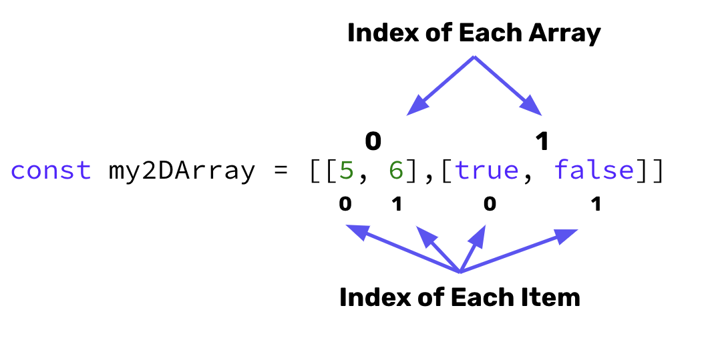

# Arrays
- An array allows for us to store list of items in a single variable.

    ```javascript
    let myFavFoods = ["Fish and Chips", "Tacos", "Pizza", "Pasta", "Sushi"]
    ```

- Arrays are accessed using index numbers which start at zero.


- A 2-Dimensional array is an array of arrays or a matrix. These are accessed using indexes as well.



## Array CRUD: Literal Syntax

- **CREATE**:(1) Declare a variable, (2) set the variable equal to `[]`, and (3) add the values of the array inside the brackets. 

    ```javascript
    let avengers = ["Iron Man", "Thor", "Captain America", "The Hulk", "Spider Man", "Ant Man"];
    ```

- **READ**: Use the name of variable that holds the array followed by the index of where the value is located in the array.

    ```javascript
    // prints out "Thor"
    console.log(avengers[1])
    // prints out "The Hulk"
    console.log(avengers[3])
    ```

- **UPDATE**: Use the name of the variable that holds the array followed by the index of where this value will go. This is then set equal to the updated value.

    ```javascript
    // Replaces "Thor" with "Black Panther"
    avengers[1] = "Black Panther"
    ```

- **DELETE**: `.pop()`, `.shift()`, and `splice()` are array methods that can be be called on the array to remove values. 

    ```javascript
    // Deletes the first value ("Iron Man")
    avengers.shift();
    // Deletes the last value ("Ant Man")
    avengers.pop();
    // Deletes value(s) at the provided index (e.g. deletes 1 item starting at index 2)
    avengers.shift(2, 1)
    ```

## Crating Arrays with a Constructor Method
The keyword `new` instance of an object through its constructor method.

```javascript
let arr = new Array();

// Creates an array with no values (i.e. [])
```

We can initialize with values by passing the values as parameters to the constructor method:

```javascript
let justiceLeague = new Array("Batman", "Superman", "The Flash", "Wonder Woman", "Aquaman")
```

## #checkoutTheDocs 🔍
- **W3Schools**: [JavaScript Arrays](https://www.w3schools.com/js/js_arrays.asp)
- **W3Schools**: [JavaScript Array Methods](https://www.w3schools.com/js/js_array_methods.asp)

## Video Resources 🎥
- [JavaScript Arrays](https://www.youtube.com/watch?v=oigfaZ5ApsM)