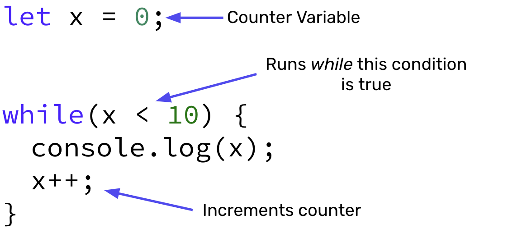

# While Loops

- A loop is a sequence of instructions that is continually repeated until a certain condition is reached.
- `while` loops are a type of loop that run ***while*** a condition is `true`. A while loop will only stop once the condition evaluates to `false`.

## While Loops Syntax 🖊



## `while` Loops Example

For example, the following code:

```javascript
let count = 0; // counter variable

while(count < 5){ // run while count is less than 5
    console.log("Current Count: " + count);
    count++; // increment count by 1
}
```

would produce the following output to your console:

```shell
Current Count: 0
Current Count: 1
Current Count: 2
Current Count: 3
Current Count: 4
```

The value 5 is not printed out because when `count = 5` this will result in `count < 5` to evaluate to `false`, which stops the `while` loop.

## #checkoutTheDocs 🔍
- **MDN**: [while Loops](https://developer.mozilla.org/en-US/docs/Web/JavaScript/Reference/Statements/while)

## Video Resources 🎥
- [While Loops Intro](https://www.loom.com/share/7eda89f072744e78a83c608b07f742b0)
- [While Loops and Counters Example](https://www.loom.com/share/f9aa7423a7e4418f9ae68fdfd69e43ae)