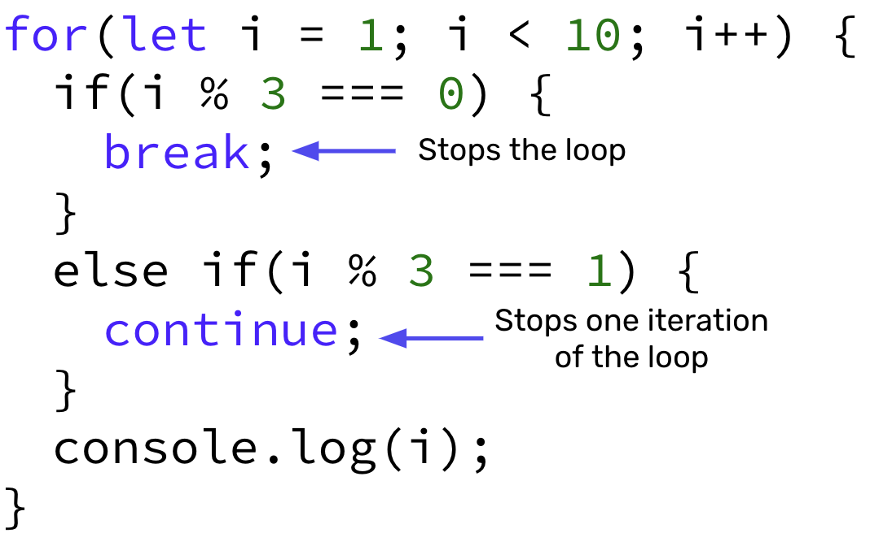

# Nested Loops
- You can place a loop inside another loop. This is known as a **nested loop**.
- For each iteration of the outer loop, the inner loop will be re-run. This means that the inner loop will run many more times than the outer loop.
- This is often used when working with two dimension like rows and columns of a table.

## Nested Loop Example

The following nested loop contains an outer and inner loop:

```javascript
for(let i = 0; i < 3; i++){ // Outer Loop
    for(let j = 0; j < 3; j++){ // Inner Loop
        console.log(`Outer Loop: ${j}, Inner Loop: ${j}`)
    }
}

```

Running this code will produce the following output to your console:

```shell
Outer Loop: 0, Inner Loop: 0
Outer Loop: 0, Inner Loop: 1
Outer Loop: 0, Inner Loop: 2
Outer Loop: 1, Inner Loop: 0
Outer Loop: 1, Inner Loop: 1
Outer Loop: 1, Inner Loop: 2
Outer Loop: 2, Inner Loop: 0
Outer Loop: 2, Inner Loop: 1
Outer Loop: 2, Inner Loop: 2
```

Notice that every time the outer loop is incremented by 1, the inner loop will be executed again. Thus, the outer loop ran 3 times (counting from 0 to 2) and the inner loop ran 9 times (counting from 0 to 2) during this program.

## Video Resources 🎥
- [Intro to Nested Loops](https://www.loom.com/share/39f0a1193b7442c2ab65695752af8c85)
- [JavaScript for Beginners: Nested Loops](https://www.youtube.com/watch?v=5FwBd2eZcNM&t=1s)

# Loop Control Statements

- When working with `while` and `for` loops, there may be cases where we want to introduce more control besides just the stopping condition. 
- We use loop control statements (`break` and `continue`) to give us more granular control over each iteration of a loop. 
- The `break` statement "jumps out" of a loop (i.e. it ***breaks*** out of the loop).
- The `continue` statement "jumps over" one iteration in the loop.

## Loop Control Statements Syntax 🖊



## `break` and `continue` Examples

Suppose we have the following code:

```javascript
for (let i = 0; i < 10; i++) {
    if (i === 3) { 
        break; 
    }
    console.log(i);
}
```

The console for this will output:

```shell
0
1
2
```

When i = 3, the `if(i === 3)` evaluates to true. This results in the `break` command being run and the `for` loop being stopped.

Let's do the same code, but with a `continue` statement:
```javascript
for (let i = 0; i < 10; i++) {
    if (i === 3) { 
        continue; 
    }
    console.log(i)
}
```

The console will now output:
```shell
0
1
2
4
5
6
7
8
9
```

The continue statement breaks the loop for one iteration of the loop, so when `i === 3`, this will break the loop only for this single iteration.

## #checkoutTheDocs 🔍
- **W3Schools**: [JavaScript Break and Continue](https://www.w3schools.com/js/js_break.asp)

## Video Resources 🎥
- [JavaScript break and continue](https://www.youtube.com/watch?v=YZ-e2vKKKe0&list=PL98qAXLA6afsQO62IkkidTHXmuL6k2rR6)
- [Loop Control Statements](https://www.loom.com/share/4c7867c6e0a64012a96ec40100a3f5bb)