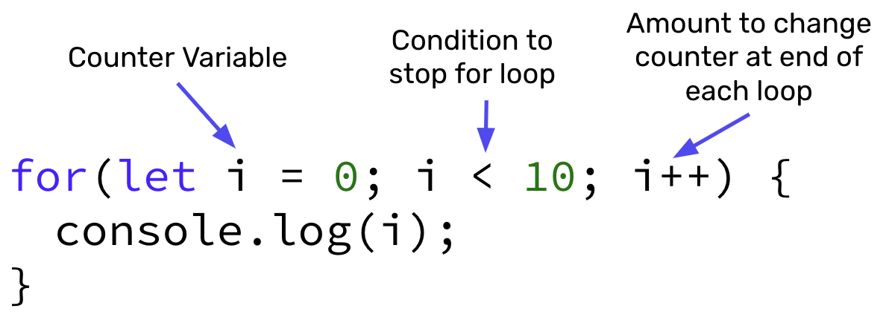

# `for` Loops

- A loop is a sequence of instructions that is continually repeated until a certain condition is reached.
- A `for` loop will loop through a block of code for a set number of times. 
- Anything that can be accomplished with a `for` loop can also be done with a `while` loop, but each loop has different cases where they are most useful.

## `for` Loops Syntax 🖊



## `for` Loops Example

Suppose you wanted to count up from 1 to 7, you could write the following `for` loop:

```javascript
for(let i = 1; i <= 7; i++){
    console.log(`The value of i is ${i}`)
}
```

The console for this would print:
```shell
The value of i is 1
The value of i is 2
The value of i is 3
The value of i is 4
The value of i is 5
The value of i is 6
The value of i is 7
```

## #checkoutTheDocs 🔍
- **MDN**: [for Loops](https://developer.mozilla.org/en-US/docs/Web/JavaScript/Guide/Loops_and_iteration)

## Video Resources 🎥
- [For Loops Intro](https://www.loom.com/share/bba3b1971b154371991395fe7d9c2d8a)
- [For Loops and Counters Example](https://www.loom.com/share/76618fa546694957a641b9110cdbc3d6)