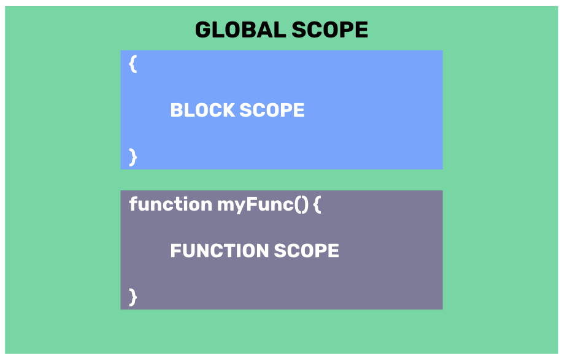

# Scope
- Scope determines the accessibility (visibility) of variables.
- JavaScript has 3 types of scope:
    - Block scope
    - Function scope
    - Global scope
- **Block Scope**: Variables declared using `let` or `const` inside a `{ }` block cannot be accessed from outside the block:

```javascript
{
  let x = 2;
  // x CAN be used here

}
// x can NOT be used here
```

- **Function Scope**: Variables defined inside a function are not accessible (visible) from outside the function.

```javascript
// myVar CANNOT be used here

function functionScope(){
    let myVar = "Hello!"
    // myVar CAN be used here

}

// myVar CANNOT be used here
```

- **Global Scope**: Variables declared outside the function and/or block scope.

```javascript
let myName = "Benny";
// code here CAN use c

function myFunction() {
    // code here CAN also use myName
}
```

- The following summarzes the 3 different types of scope in JavaScript.



## #checkoutTheDocs 🔍
- **W3Schools**: [JavaScript Scope](https://www.w3schools.com/js/js_scope.asp)

## Video Resources 🎥
- [JavaScript Scope](https://www.youtube.com/watch?v=iJKkZA215tQ)