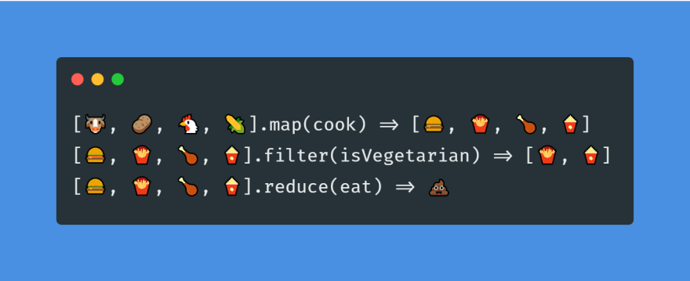

# `map`, `filter`, and `reduce` Methods in JavaScript

- The Javascript methods `map`, `filter`, and `reduce` are methods that will iterate over an array and perform a transformation or computation.
- Each of these methods will return a new array.
- A simple summary of each is shown in the diagram below:




## `.map()`

The `map()` method creates a new array that contains the results of calling a provided function on every element in the array.

```javascript
const arr = [1, 2, 3, 4];

// Creates an array that contains each element in the original array multiplied by 2.
const result = arr.map(val => val * 2);

console.log(result); // [1, 3, 6, 8]
```

## `.filter()`

The `filter()` method takes each element in an array and applies a conditional statement for each item. If the conditional statement is true, the value is pushed to the output array.

```javascript
const arr = [1, 2, 3, 4];

// If the value is divisible by 2 (i.e. it is even), then push it to the result array.
const result = arr.filter(val => val % 2 === 0);

console.log(result); // [2, 4]
```

## `.reduce()`

The `reduce()` method ***reduces*** an array down to just one value. The reduce method has the following syntax:

```javascript
arr.reduce(callbackFunction, initialValue);
```

The `callbackFunction` is the function that is called once for every item in the array. The function can take four arguments: 
    - **`accumulator`**: The returned value of the previous iteration
    - **`currentValue`**: The current item in the array
    - **`index`**: The index of the current item
    - **`array`**: The original array on which reduce was called

Typically, we only use the first two arguments: `accumulator` and `currentValue`. 

```javascript
// Array of numbers
const numbers = [1, 2, 3, 4];
// Sum is the reduced value that results from summing each value in the array
const sum = numbers.reduce(function(result, item){
    return result + item;
}, 0);
```

Often `reduce()` is used on an array of numbers, but it also can be used to count up instances and return an object that is the sum of the instances of each item in the array. **NOTE**: The initial value is an empty object that will be the initial value of the accumulator.

```javascript
var pets = ["dog", "chicken", "cat", "dog", "chicken", "chicken", "rabbit"];

var petCounts = pets.reduce(function(obj, pet){
    // If the item is not in the object, add with an initial value of 1
    if (!obj[pet]) {
        obj[pet] = 1;
    } else {
        // If the item is in the object, increment the value by 1.
        obj[pet]++;
    }
    return obj;
}, {});

console.log(petCounts); 

/*
Output:
 { 
    dog: 2, 
    chicken: 3, 
    cat: 1, 
    rabbit: 1 
 }
 */
```

## #checkoutTheDocs 🔍
- **MDN**: [`Array.prototype.map()`](https://developer.mozilla.org/en-US/docs/Web/JavaScript/Reference/Global_Objects/Array/map)
- **MDN**: [`Array.prototype.filter()`](https://developer.mozilla.org/en-US/docs/Web/JavaScript/Reference/Global_Objects/Array/filter)
- **MDN**: [`Array.prototype.reduce()`](https://developer.mozilla.org/en-US/docs/Web/JavaScript/Reference/Global_Objects/Array/reduce)

## Video Resources 🎥
- [Map, Filter, Reduce Explained](https://youtube.com/watch?v=8MoElay6dWU&feature=shares&t=76)