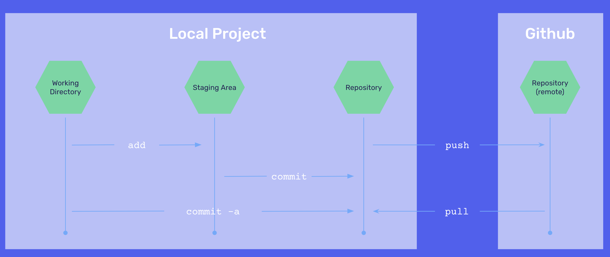

# `git` Commands
- `git` is how we track everything, including file revisions, that we are changing locally on our machine.
- GitHub is one (of many) places where we put these local files 
so that we can save our projects outside our machine and easily collaborate with others.
- We use `git` commands to move work stored locally to a remote location like GitHub.

## `git` Commands Summary
Below is a list of common git commands. There are many other commands besides these. See the documentation at the end of this lesson for a helpful cheat sheet!

| git Command | What It Does |
| ----------- | ------------ |
| `git init`  | Initializes a git repository. Running the command creates a folder called “.git” in your directory. |
| `git commit` | Saves the current state of your project at this point in time. The history of your git repository is simply a listing of commits that represent all the changes you’ve made to your repository over time. |
| `git add .` | Adds every change currently in your folder to the staging area. `git commit` will only commit files that are in the staging area. |
| `git add fileNameHere.js` | Adds a specific file to the staging area. `git commit` will only commit files that are in the staging area. |
| `git push` | Takes your local git commits and pushes them onto a remote repository |
| `git pull` | Takes commits from a remote repository and updates your local repository with them |
| `git clone` | Takes a repository that already exists on Github (or some other place) and copies it to your local computer |

## Workspace, Staging Area, and GitHub
When working with `git` and GitHub, there are three key areas to consider:
- **The Workspace**: Our locally saved version of files. Use `git add` to move items from here to the staging area.
- **The Staging Area**: Place for all the files and items we want to create a commit of (may not necessarily be every file every time). The holding space for everything that we are going to create a new version with. Use `git commit` to move items from staging area to the repository we will push to the GitHub repository.
- **The GitHub Repository** (remote): This is our file saved on some other machine (usually GitHub). Using `git push` and `git pull`, we can either ***push*** a new commits to the remote repository or ***pull*** updated versions from a collaborator from the remote repository to update our local code with their code.

## Try It Out 💻
1. Navigate to [Learn Git Branching](https://learngitbranching.js.org/?locale=en_US) to practice various `git` commands and deepen your understanding of `git`.

## #checkoutTheDocs 🔍
- **GitHub**: [git Cheat Sheet](https://education.github.com/git-cheat-sheet-education.pdf)

## Video Resources 🎥
- [Git It? How to Use Git and GitHub](https://www.youtube.com/watch?v=HkdAHXoRtos)