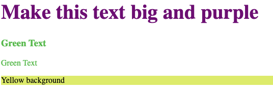

# CSS Essentials
- CSS is the language used to style HTML documents and describes how HTML elements should be displayed on the page.
- We style pages by writing **CSS rulesets** that consist of (1) a selector and (2) a declaration that contains a property/value pair.
- CSS selectors are use to target specific elements based on element tag, class name, id, and many other different selector types. 
- CSS rulesets can be written inline, internal inside a `<style>` tag, or in an external `.css` file.

## CSS Ruleset Syntax 🖊️


## CSS Ruleset Example

We have the following HTML `index.html` document:

```html
<!DOCTYPE html>
<html>
    <head>
        <title>Styling with CSS</title>
        <link href = "./style.css" rel = "stylesheet">
    </head>
    <body>
        <h1>Make this text big and purple</h1>
        <h3 class = "greenText">Green Text</h3>
        <p class = "greenText">Green Text</p>
        <p class = "yellowBackground">Yellow background</p>
    </body>
</html>
```

The corresponding `style.css` contains the following rulesets:

```css
h1 {
    color: purple;
    font-size: 40px;
}

/* Selects all elements that have a class of "greenText"*/
.greenText {
    color: #46c24e;
}

/* Selects element with ID of "yellowBackground" */
#yellowBackground {
    background-color: rgb(226, 235, 106);
}
```

This will output the following page:



A few things to note:
- All rulesets start with a `{` and end of with `}`.
- The selector comes before the `{}`. The above example contains a selector for an HTML element, a class, and an ID. There are many other selectors to pick from, so use the documentation.
- A CSS ruleset can have many property/value pairs, but each property and value **MUST** be separated by a `:` and each property/value pair **MUST** be separated by a `;`.
- There are hundreds of CSS properties, so make sure to utilize the documentation when deciding on different styles.

## Try It Out 💻
1. Navigate to [Free Code Camp: Learn Basic CSS](https://www.freecodecamp.org/learn/2022/responsive-web-design/learn-basic-css-by-building-a-cafe-menu/step-1).
2. Follow the instructions and use CSS to build a Cafe Menu! 

## #checkoutTheDocs 🔍
- **W3Schools**: [CSS Selector Reference](https://www.w3schools.com/cssref/css_selectors.php)
- **W3Schools**: [CSS Properties Reference](https://www.w3schools.com/cssref/index.php)

## Video Resources 🎥
- [Learn CSS in 20 minutes](https://www.youtube.com/watch?v=1PnVor36_40)