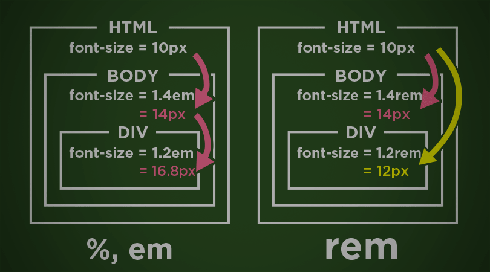

# Length Units
- Pixels (`px`) are the absolute unit of measurement used in CSS. `1 px` is the same size regardless of the type of device/screen the content is being viewed on.
- Often, we wish to use relative length units since screen size will vary from device to device. Relative length units we typically use in CSS are:
    - Percentage Length Unit (`%`)
    - `em` Length Unit
    - `rem` Length Unit

## Absolute Length Unit: `px`

Because pixels are absolute units of measurement, it will remain a certain length despite the size of the screen rendering the content whether it’s a phone, a laptop, or a tablet.

The following CSS ruleset will style an h1 element to be `20px` (about 5.2 mm or 0.20 inches) regardless of the type of screen it is viewed on.

```css
h1 {
    /* Sizes the font to take up 20 pixels of space on any screen */
    font-size: 20px;
}
```

## Relative Length Units: `%`, `em`, and `rem`

The **percentage length unit** describes the amount of the parent element that the child element should take up. The example below style an `h1` to take up 60% of the available space on the screen. 

```css
h1 {
    font-size: 60%;
}
```

The `em` length unit sizes elements relative to the font size of the element. In the example ruleset below, if the `h1` element has a parent that has a `font-size: 20px`, then then the `h1` element has a `font-size` of `28px` (20px * 1.4).

```css
h1 {
    font-size: 1.4em;
}
```

The `rem` length unit sizes elements relative to the ***ROOT*** element. For the example below, if the `html` root element has a `font-size: 10px` and the `h1` has a parent of `font-size: 15px`, then the `h1` of `1.5rem` would be `15px` because it's sized relative to the root element, NOT the parent element

```css
h1 {
    font-size: 1.5rem;
}
```

The picture below can help to distinguish between  `rem` and `em` length units:



## #checkoutTheDocs 🔍
- **W3Schools**: [CSS Units](https://www.w3schools.com/cssref/css_units.php)

## Video Resources 🎥
- [Learn CSS Units in 8 Minutes](https://www.youtube.com/watch?v=-GR52czEd-0)