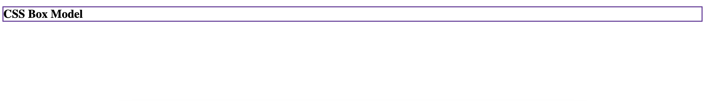
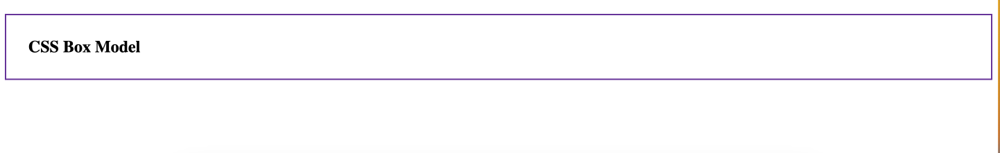
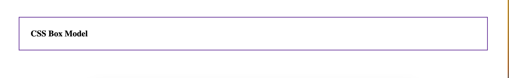

# Box Model
- When laying out a document, the browser's rendering engine represents each element as a rectangular box according to the standard CSS box model.
- Every box is composed of four parts, defined by their respective edges: 
    - **Content**: Refers to the text and image elements that are displayed on the screen. This property is visible (obviously since its your content!).
    - **Padding**: Refers to the space around the content and before the border. The padding is transparent, but the size can be altered.
    - **Border**: The true edge of the content. It wraps around your content ***and*** padding. This property is visible and there are CSS Properties to not only increase its size but also style it.
    - **Margin**: Refers to the space outside your border where one CSS box interacts with other CSS boxes. It is transparent, but the size can be altered.


## Box Model Example

Suppose we have the following HTML and CSS files.

**`index.html`**
```html
<h2>CSS Box Model</h2>
```

**`style.css`**
```css
h2 {
  border: 2px solid rebeccapurple;
}
```

This would output the following:



Adding a `padding: 2rem` to the `h2` ruleset would alter the output by adding `2rem` of padding to each side of the content:



Adding a `margin: 3rem` to the `h2` ruleset would add a margin of `3rem` to each side of the content.



## Try It Out! 💻
1. Navigate to [Free Code Camp: Learn CSS Box Model](https://www.freecodecamp.org/learn/2022/responsive-web-design/learn-the-css-box-model-by-building-a-rothko-painting/step-1)
2. Build a Rothko-style rectangular art pieces using CSS!

## #checkoutTheDocs 🔍
- **MDN**: [The Box Model](https://developer.mozilla.org/en-US/docs/Learn/CSS/Building_blocks/The_box_model)

## Video Resources 🎥
- [Learn CSS Box Model](https://www.youtube.com/watch?v=rIO5326FgPE)