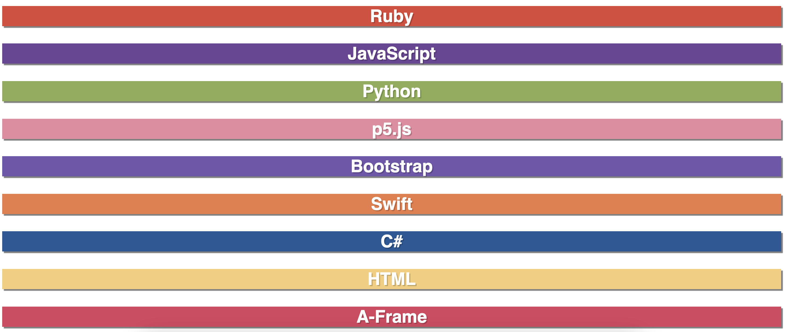
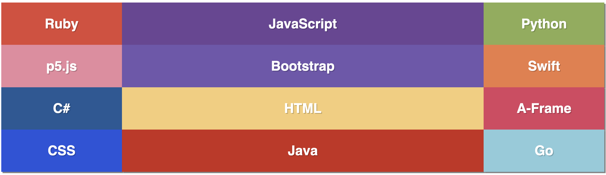
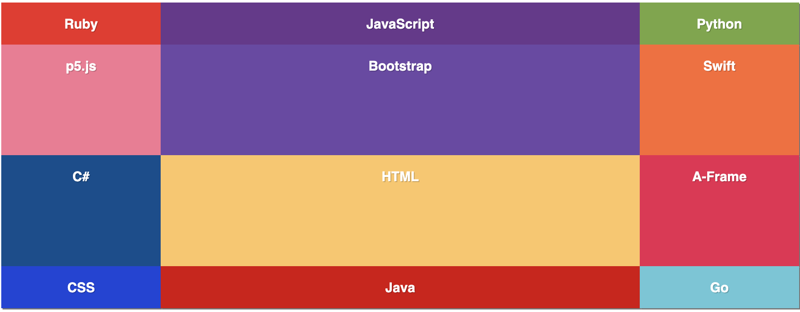
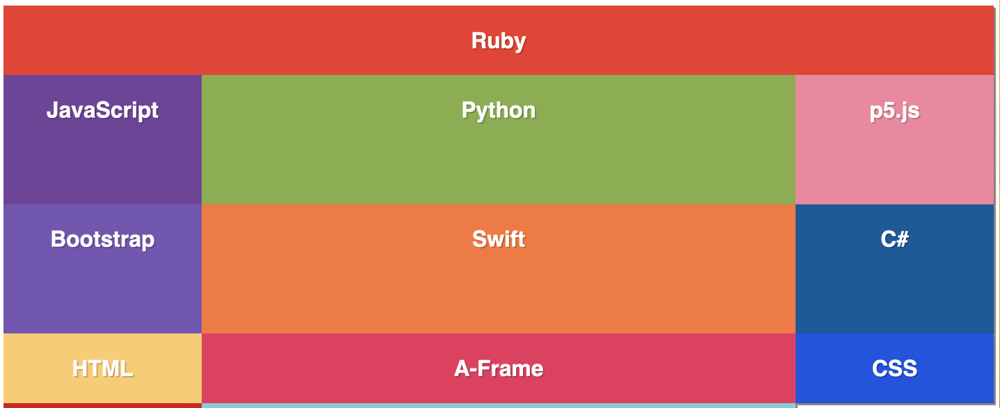
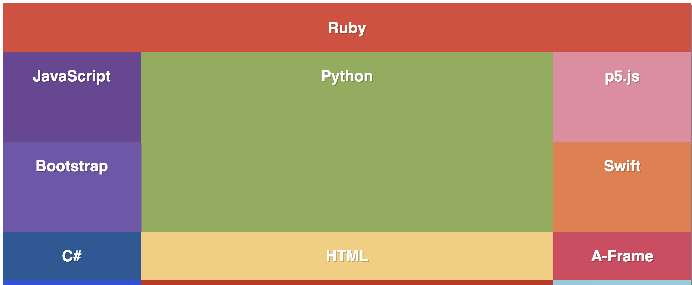

# CSS Grid
- CSS Grid is a two-dimensional grid-based layout system that allows us to organize content on the page.
- An container element is defined as a grid by using `display: grid`.
- Column and row sizes are set using `grid-template-columns` and `grid-template-rows` respectively.
- Child elements are placed in a grid using `grid-column` and `grid-row`.

## CSS Grid Example

>You can [use this Codepen](https://codepen.io/stevenjlance/pen/WNKaRmv) to try out the examples discussed below.

An initial HTML document has been created and styled with CSS. However, we want to be able to organize each cell so that multiple can be in a row together. Luckily, we can use CSS grid to achieve this!



### `display: grid`

A grid container is defined and established using `display: grid`.

```css
.container {
    display: grid;
}
```

Not much will happen to our page yet besides the grid items taking up the remaining whitespace.


### `grid-template-columns` and `grid-template-rows`

The properties of `grid-template-rows` and `grid-template-columns` defines how the space of rows and columns will be distributed. 

Suppose we want a grid that is 3 columns wide with the two side columns each taking up 20% of the available space and the center column taking up the remaining space. `grid-template-columns` can then be set to:

```css
.container {
    display: grid;
    grid-template-columns: 20% auto 20%;
}
```

This would style our grid like:



> **NOTE**: You can use any CSS sizing (`px`, `em`, etc.) to size your columns. `auto` will take up all remaining space.

Now that we have our columns, we want the second and third row to be the largest. `grid-template-rows` can set the size of the rows by doing the following:

```css
.container {
    display: grid;
    grid-template-columns: 20% auto 20%;
    grid-template-rows: 100px 30vh 30vh auto;
}
```

`vh` is relative to 1% of the viewport's (i.e. browser's) height. So this will have each of the two middle rows take up 30% of the available browser space.



### `grid-column` and `grid-row`

The previous properties sets up the grid container. However, we also want to be able to define how much space grid items can take up. `grid-column` and `grid-row` can be used to define how much space each grid item should take up.

We want the first "Ruby" element to take up the entire first row. We can achieve this by styling this `div` with `grid-column`.

```css
#ruby {
    grid-column: span 3;
}
```

The `span 3` will cause the ruby element to now span across 3 columns.



Now, we want the python element to take up two rows. We can style the python `div` with `grid-row`:

```css
#python {
    grid-row: span 2;
}
```

`span 2` will cause the python element to now span across 2 rows.



## Try It Out 💻
1. Navigate to [CSS Grid Garden](https://cssgridgarden.com/).
2. Try to complete all 24 levels using only CSS Grid!

## #checkoutTheDocs 🔍
- **CSS Tricks**: [A Complete Guide to CSS Grid](https://css-tricks.com/snippets/css/complete-guide-grid/)

## Video Resources 🎥
- [Learn CSS Grid in 20 Minutes](https://www.youtube.com/watch?v=9zBsdzdE4sM)