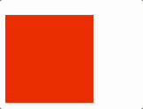

# CSS Animations
- CSS allows animation of HTML elements ***without*** using JavaScript.
- CSS Animations are divided into two categories: (1) transitions and (2) animations.
- Transitions are an element changing from one state to another over a given duration.
- Animations allow for changing of CSS properties as many times as you want (as opposed to changing once with transitions).

## Transitions
Transitions are an element changing from one state to another and are the most common use case for animations. Consider a simple example of hovering over an element and causing it to grow:


A transition requires going between two distinct states. In the example above there are: 
1. A smaller box state for when the mouse is not hovering over.
2. A larger box state for when the mouse is hovering over.

Transitions have 2 required properties and 2 optional properties:
1. `transition-property` (**REQUIRED**): Which properties to animate.
2. `transition-duration` (**REQUIRED**): WHow long the animation lasts.
3. `transition-timing-function`: How the intermediate states are calculated.
4. `transition-delay`: Start the animation after a certain amount of time.

### Transitions Example
> You can use [this CodePen](https://codepen.io/stevenjlance/pen/mdjQRzj) to practice the code example below.

A basic button has been created that we want to grow larger when we hover over it.


Start by setting the `transition-property` of the button to be `transform`.

```css
.btn {
  /* Some initial styles not shown*/
  transition-property: transform; 
}
```

We want to transform the button to 1.5 times the size over a 0.5 second interval when the mouse hovers. This can be achieved by doing:

```css
.btn:hover {
  transform: scale(1.5);
  transition-property: transform;
  transition-duration: 0.5s; 
}
```

You can add two additional properties of `transition-delay` and `transition-function`. Explore the documentation to see how this works!

## Animations
Animations require an `@keyframes` rule that controls the intermediate steps in a CSS animation sequence by defining style for keyframes along an animation sequence.

### Animations Example
> You can use [this CodePen](https://codepen.io/stevenjlance/pen/dyjQzxB) to practice the code example below.

We want to animate a square to go from red to yellow.



We start by writing a `@keyframes` ruleset that names our animation. We'll call this one `example`.

```css
@keyframes example {
    /* Starting properties */
    from {
        background-color: red;
    }
    /* Ending properties */
    to {
        background-color: yellow;
    }
}
```

We then do the following:
1. Use `animation-name` to identify the name of our animation for the div.
2. Define the `animation-duration` in seconds 

```css
div {
    /* Initial styling property/values */
    width: 100px;
    height: 100px;
    background-color: red;
    /* Animation property/values */
    animation-name: example;
    animation-duration: 4s;
}
```

You can also make this last for an infinite amount of time by adding the property value of `animation-iteration-count: infinite` to the div ruleset.

## Try It Out 💻
1. Navigate to [Free Code Camp Animation Activity](https://www.freecodecamp.org/learn/2022/responsive-web-design/learn-css-animation-by-building-a-ferris-wheel/step-1).
2. Use the guided steps to build a ferris wheel using CSS Animations!

## #checkoutTheDocs 🔍
- **W3Schools**: [CSS Transitions](https://www.w3schools.com/css/css3_transitions.asp)
- **W3Schools**: [CSS Animations](https://www.w3schools.com/css/css3_animations.asp)

## Video Resources 🎥
- [Learn CSS Animations in 15 Minutes](https://www.youtube.com/watch?v=YszONjKpgg4)