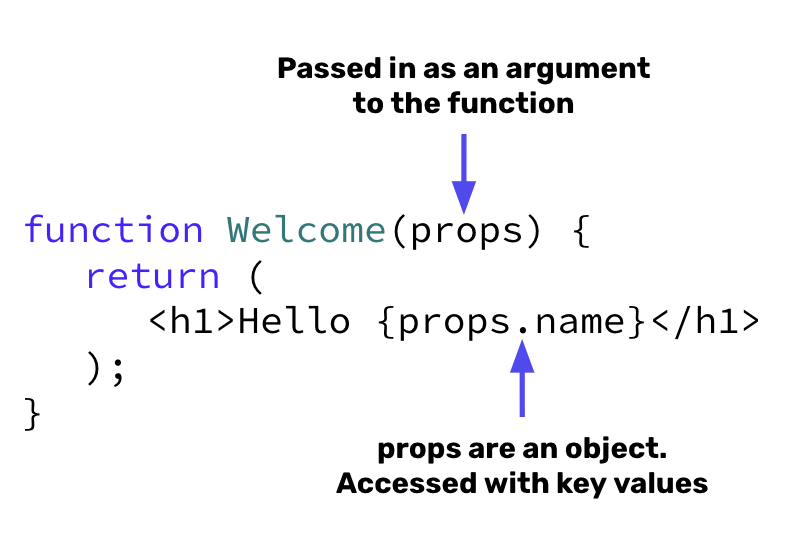

# React Props
- With our React components, we can include some extra information on the component through properties (or often simply just called props).
- Props are arguments passed into React components.
- Props allow general components to be specialized based on the information that is provided (e.g. a set of `Card` components on a page look different due to props passed to the the `Card`). 
- Every parent component can pass some information to its child components by giving them props.


*<center>An example of components on AirBnb. Each card component gets different images, titles, prices, etc.</center>*

## Props Syntax 🖊️

Similar to HTML attributes, props are any one word name that are added inside the Component invocation.


To assign props, we add a parameter of `props` to the function definition.



## Props Example 

Suppose we have a `Greet` component that will render the message:

```plaintext
Hello NAME_GOES_HERE!
I also like the color PERSONS_FAVORITE_COLOR
```

If we want to render this component 3 different times on the page with different names and colors, we can give `Greet` the following props:

```jsx
function App() {
    <Greet name = "Elizabeth" color = "blue"/>
    <Greet name = "Francis" color = "pink"/>
    <Greet name = "Benny" color = "yellow"/>
}
```

The `name` and `color` are props passed from the `App` component to the `Greet` component as an object. These can be accessed in the `Greet` component by adding props as a parameter:

```jsx
function Greet(props){
    return(
        <h1>Hello {props.name}!</h1>
        <h3>I also like the color {props.color}</h3>
    )
}
```

Since props is an object, we can also access the values of props through destructuring:

```jsx
function Greet({ name, color }){
    return(
        <h1>Hello {name}!</h1>
        <h3>I also like the color {color}</h3>
    )
}
```

## #checkoutTheDocs 🔍
- **React**: [Passing Props to a Component](https://beta.reactjs.org/learn/passing-props-to-a-component)

## Video Resources 🎥
- [React Tutorial - Props](https://www.youtube.com/watch?v=m7OWXtbiXX8c)