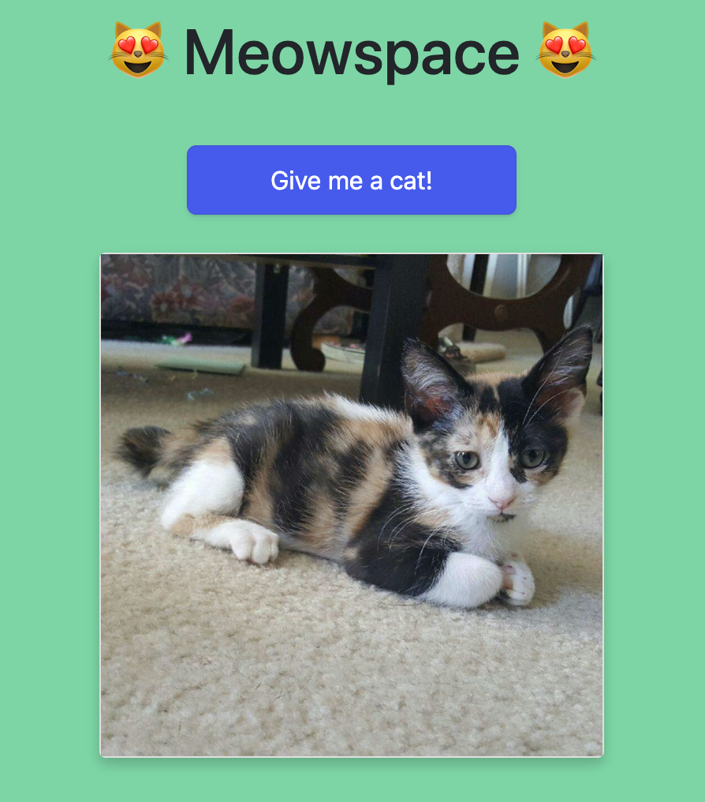

# Meowspace 😻

**TASK**: Don't you just wish you could go to a webpage and it would pull up a random image of a cat? Right?!? Me too. Luckily, the good folks at Meowspace have created the page, but they need your help hooking up the [cat API](https://aws.random.cat/meow?ref=apilist.fun) so that it renders a new image every time the button is clicked.

## What To Do

All work for this should be done in `App.js` and `Cat.js`

### `App.js`
1. Import `useState` and the `Cat` component at the top of the file.
2. Create a `catPic` state variable and a `setCatPic` updater function. Initialize the `catPic` state with a value of `""`.
3. Create an asynchronous function called `fetchCat` that does the following:
    - `fetch` data the https://aws.random.cat/meow?ref=apilist.fun
    - Convert the response to a JSON object.
    - Update the `catPic` state with the image URL. **NOTE**: Take a look at the API endpoint to find the key for the image URL.
4. In the `<button>` element, create an `onClick` event that calls the `fetchCat` function.
5. In the `
`, conditionally render a `Cat` component when `catPic` does not have a value of `""`. Pass the url of the image to the `Cat` component.

### `Cat.js`
1. Destructure the image url in the `Cat` component parameters.
2. Render the image inside the `` element.
3. Click the button to see some cats!