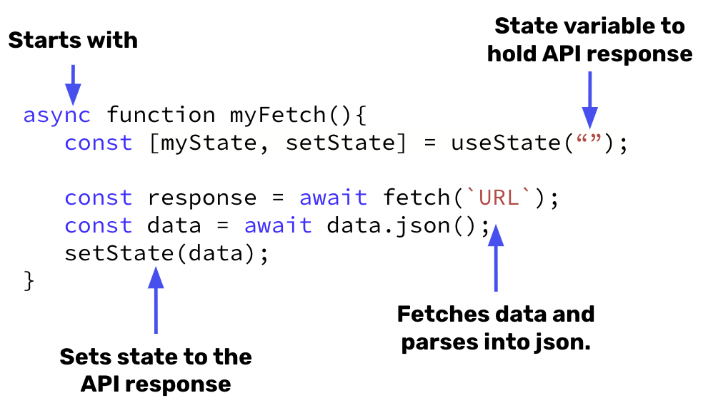

# `fetch` in React
- We use `async/await` and `.then` get data from an API.
- Using `fetch`, we can store an API response in a state variable and render it using the event handlers like `onClick`.
- `fetch` works by (1) asking for data from a URL and (2) the data coming back, and (3) doing something with this data. No page refresh is necessary to achieve this process.

## `fetch` and React Syntax 🖊️



## `fetch` in React Example

We want to create a component that fetches a random image of a dog using the [Dog API](https://dog.ceo/dog-api/documentation/random). we start by initializing state that will hold our image URL 

```jsx
function DogPicture() {
    const [dogURL, setDogURL] = useState("");

    return(
        <>
            
            <button type = "submit">Show me a dog</button>
        </>
    )

}
```

Next, we want to create a `handleClick` function that will
1. fetch the data from the [API endpoint](https://dog.ceo/api/breeds/image/random)
2. Convert the response into a JSON object
3. Update dogURL state with the image address.

```jsx
function DogPicture() {
    const [dogURL, setDogURL] = useState("");

    const handleClick = async () => {
        const response = await fetch("https://dog.ceo/api/breeds/image/random");
        const data = await response.json();
        setDogURL(data.message)
    }

    return(
        <>
            
            <button type = "submit">Show me a dog</button>
        </>
    )

}
```

Finally, we need to call the `handleClick` function when the button has an `onClick` event.

```jsx
function DogPicture() {
    const [dogURL, setDogURL] = useState("");

    const handleClick = async () => {
        const response = await fetch("https://dog.ceo/api/breeds/image/random");
        const data = await response.json();
        setDogURL(data.message)
    }

    return(
        <>
            
            <button 
                type = "submit"
                onClick = { handleClick }
            >Show me a dog</button>
        </>
    )

}
```

## #checkoutTheDocs 🔍
- **React**: [AJAX and APIs](https://reactjs.org/docs/faq-ajax.html)
- **MDN**: [fetch](https://developer.mozilla.org/en-US/docs/Web/API/Fetch_API)
- **MDN**: [Promise.prototype.then()](https://developer.mozilla.org/en-US/docs/Web/JavaScript/Reference/Global_Objects/Promise/then)

## Video Resources 🎥
- [Fetch Data Using Fetch API in React JS](https://www.youtube.com/watch?v=27f3B1qndW8)