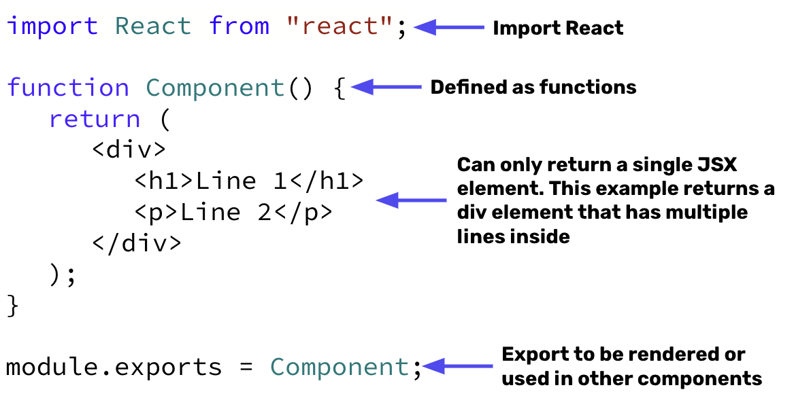

# React Components
- React pages are made up of components or independent and reusable UI elements for your app
- React components lets you combine your HTML, CSS, and JavaScript.
- Components are declared using a function that starts with a capital letter and can be exported and then rendered in other components.
    - **NOTE**: Class based components are possible, but beyond the scope of this introduction.
- Components return a single JSX element and can be rendered as many times as you want.

## Components  Syntax 🖊



This could then be rendered in an `App` component as follows:

```jsx
import React from 'react';
// Import the component file
import Component from "./Component";

function App() {
    <>
        {/*Render the Component element twice*/}
        <Component/>
        <Component/>
    </>
}

// Export App component containing two Component elements to another component and/or to be rendered
module.exports = App;
```

## React Components Example

We want to create a Card component that will render lots of different cards on our page. We would start by declaring a `Card` function with the code for a single card element.

```jsx
import React from 'react'

function Card() {
    return(
        <div>
            <h1>This is a card title</h1>
            <p>This is some card text</p>
            <a href = "www.example.com"><p>Here's a link to another page</p></a>
        </div>
    )
}

module.exports = Card;
```

We then wish to render the `Card` element 4 times in an App component file.

```jsx
import React from 'react';
import Card from './Card';

function App() {
    <>
        <h1>This is my page with Cards</h1>
        <Card/>
        <Card/>
        <Card/>
    </>
}

module.exports = App;
```

Finally, we render our single `App` component that contains our 3 card components and page title.

```jsx
import React from "react";
import { createRoot } from 'react-dom/client';
import App from "./App"
// Select fro root element
const root = createRoot(document.getElementById('root'));
// Render App component containing h1 and 3 cards
root.render(<App/>);
```

## #checkoutTheDocs 🔍
- **React**: [Your First Component](https://beta.reactjs.org/learn/your-first-component)

## Video Resources 🎥
- [Functional Components](https://www.youtube.com/watch?v=Cla1WwguArA)