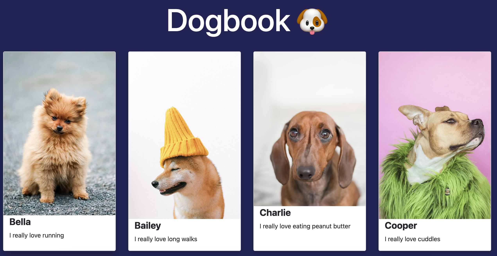

# Dogbook 🐶

**TASK**: You are part of a new social media company that wants to make a social media application for dogs to share information about themselves. Luckily, they have decided to use React for the front end.

## What To Do
1. In `App.js`, import and render 10 `Card` components.
2. In `App.js`, for each `Card` component, pass it a props value of `name` and `activity`. `name` should contain each dogs name and `activity` should contain an activity that they enjoy.
3. In `Card.js`, add props as an argument or destructure name and activity. Replace NAME with the value of the name of prop and ACTIVITY with the value of the activity prop.
4. In `App.js`, import each of the images stored in the images folder. Pass each image to their corresponding card component as a prop.
5. In `Card.js`, render the image in the img tag and give it an alt value of the dogs name. If you destructured the values in step 3, don't forget to update with the image.