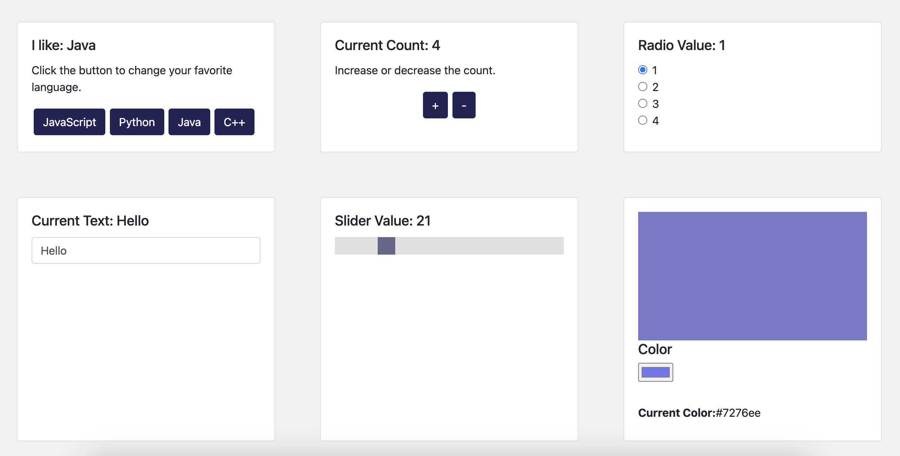

# State Buttons

**TASK**: We are going to build an app that initializes and updates state for various types of inputs (buttons, text, sliders, etc.). Each state 



## What To Do
1. In `App.js`, import each of the components (`Languages`, `Counter`, `Radio`, `TextInput`, `Slider`, and `Color`) and render them inside `app` div.
2. In `Languages.js` complete the following:
    - Import `useState` at the top of the file.
    - Inside the `Languages` function, initialize a `language` state variable and a `setLanguage` updater function. Give `language` an initial value of Ruby.
    - For each of the buttons, add an `onClick` function that updates the `language` to the value of the button using the `setLanguage` function.
    - Output the `language` state inside the `h5` element that says `I like: `.
3.  In `Counter.js`, complete the following:
    - Import `useState` at the top of the file.
    - Inside the `Counter` function, initialize a `count` state variable and a `setCount` updater function. Give `count` an initial value of 0.
    - For the button with an id of `increase`, add an `onClick` function that increases `count` by 1 every time it is clicked.
    - For the button with an id of `decrease`, add an `onClick` function that decreases `count` by 1 every time it is clicked.
    - Output the `count` state inside the `h5` element that says `Current Count: `.
4. In `Radio.js`, complete the following:
    - Import `useState` at the top of the file.
    - Inside the `Radio` function, initialize a `radioVal` state variable and a `setRadio` updater function. Give `radioVal` an initial value of `null`.
    - For each of the radio buttons, create an `onClick` function that updates the `radioVal` state to the value of each button (e.g. when they click 2 it should change the state to 2).
    const [radioVal, setRadio] = useState("");
    - Output the `radioVal` state inside the `h5` element that says `Radio Value: `.
5. **STRETCH**: In `TextInput.js`, complete the following:
    - Import `useState` at the top of the file.
    - Inside the `TextInput` function, initialize a `text` state variable and a `setText` updater function. Give `text` an initial value of an empty string.
    - Inside the `input` element, create an `onChange` function that updates the `text` state with the value currently stored in the input field. You can get the value by adding `event` as a parameter to `onChange` as follows:
    ```jsx
    <input
        onChange = { (event) => setText(event.target.value)}
    </>
    ```
    - Output the `text` state inside the `h5` element that says `Current Text: `.
6. **STRETCH**: In `Slider.js`, complete the following:
    - Import `useState` at the top of the file.
    - Inside the `Slider` function, initialize a `slideVal` state variables and a `setSlider` updater function. Give `slideVal` an initial value of 50.
    - Inside the `input` element, create an `onChange` function that updates `slideVal` state with the current value of the slider. 
        - **HINT**: You can use `event` and `event.target.value` like you did in the last problem!
    - Output the `slideValue` state inside the `h5` element that says `Slider Value: `. 
7. **STRETCH**: In `Color.js`, complete the following:
    - Import `useState` at the top of the file.
    - Inside the `Color` function, initialize a `color` state variable and a `setColor` updater function. Give `color` an initial value of null.
    - Inside the `input` element, create an `onChange` function that updates `color` state with the current value of the color input.  
    - Output the `color` state inside the `span` element.
    - Style the div with a class of `card-image` with the color state using inline styling as follows:
    ```jsx
    <div className="card-image" style={{ backgroundColor:color }}></div>
    ```