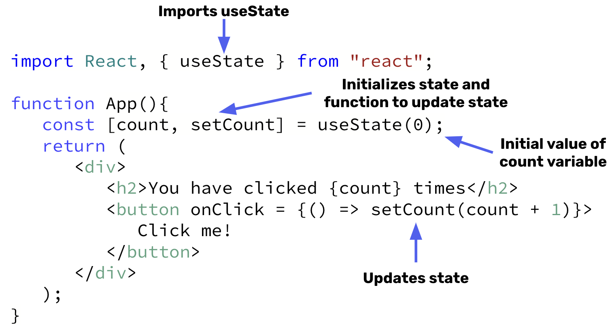

# React State
- Components need to “remember” things: the current input value, the current image, the shopping cart. In React, this kind of component-specific memory is called state.
- State is data that changes. When the state object changes, the component re-renders.
- The React `useState` hook allows us to track state in a functional component.
- `useState` accepts an initial state and returns two values:
    - The current state.  
    - A function that updates the state.

## `useState` Syntax 🖊️



## State Example

In order to use the `useState` hook, we need to first import it. Once imported, state can then be initialized by calling `useState` in the component. `useState` accepts (1) and initial state and (2) a function that will be used to update state.

In our example, the `favColor` component will have a state called `color` and a function called `setColor` that will be used to update the color. We set the initial value of `color` to by magenta.

```jsx
import { useState } from 'react';

function favColor() {
    const [color, setColor] = useState("magenta");
}
```

Now that we have state initialized, we can now use state inside our component. The value of color is accessed using `{ }` and the name of the state variable.

```jsx
import { useState } from 'react';

function favColor() {
    const [color, setColor] = useState("magenta");

    return (
        <>
            <h1>My favorite color is {color}</h1>
        </>
    )
}
```

Finally, state can be updated through the use of our updater function `setColor`. For this example, we've added a button that will update the `color` state to be blue when the button is clicked. Thus, we now have a component that starts with the phrase `"My favorite color is magenta"` and changes to `"My favorite color is blue"` when the button is clicked.

```jsx
import { useState } from 'react';

function favColor() {
    const [color, setColor] = useState("magenta");

    return (
        <>
            <h1>My favorite color is {color}</h1>
            <button
                type = "button"
                onClick = {() => setColor("blue")}
            >Change Color to Blue</button>
        </>
    )
}
```

## Incrementing State

Often we want to be able to increment values on the page. This is a value we can store in state. We then can increment this by passing the `count` variable and the amount we want to increment/decrement to the updater function. 

```jsx
import { useState } from 'react';

function Counter() {
    const [count, setCount] = useState(0);

    return(
        
        <h3>The current count is {count}</h3>
        <button
            type = "button"
            onClick = {() => setCount(count + 1)}
        > Increase Count
        </button>
        <button
            type = "button"
            onClick = {() => setCount(count - 1)}
        > Decrease Count
        </button>
    )
}
```

## #checkoutTheDocs 🔍
- **React**: [State: A Component's Memory](https://beta.reactjs.org/learn/state-a-components-memory)

## Video Resources 🎥
- [React Tutorial - Using State (useSate hook)](https://www.youtube.com/watch?v=4pO-HcG2igk)