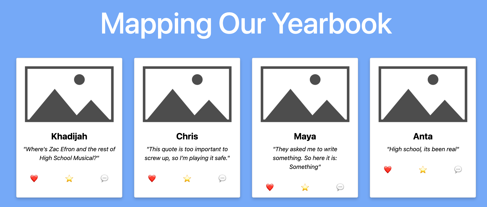

# Yearbook Map

**Task**: The local high school has hired you to create a digital yearbook for them. They want the yearbook to have an individual card for each student that contains a placeholder photo, the individual student name, the student's quote, and some buttons below each quote. The components have already been written for you, but you need to render them using `.map`.

## What To Do
1. The data is stored in a file called `data.js`. Import it into `App.js`.
2. The `YearbookCard` contains all of the card elements that you want to render for each student. Import the `YearbookCard` component into `App.js`. Render one `YearbookCard` to ensure you have imported it correctly.
3. In `App.js`, use `.map()` to render a `YearbookCard` for each student in the `data.js` file. Pass the `name` and `seniorQuote` as props to each `YearbookCard`. You should see 30 cards rendered if you have done this correctly.
4. In `YearbookCard`, render the `name` and `seniorQuote` props in each of the card.