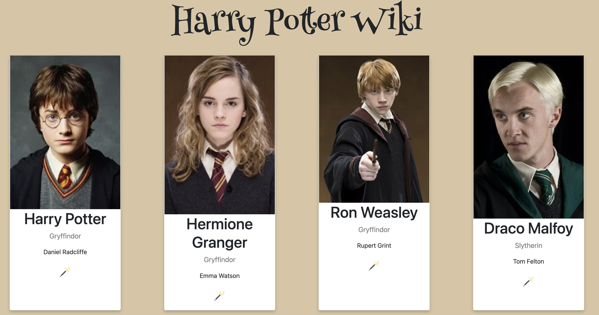
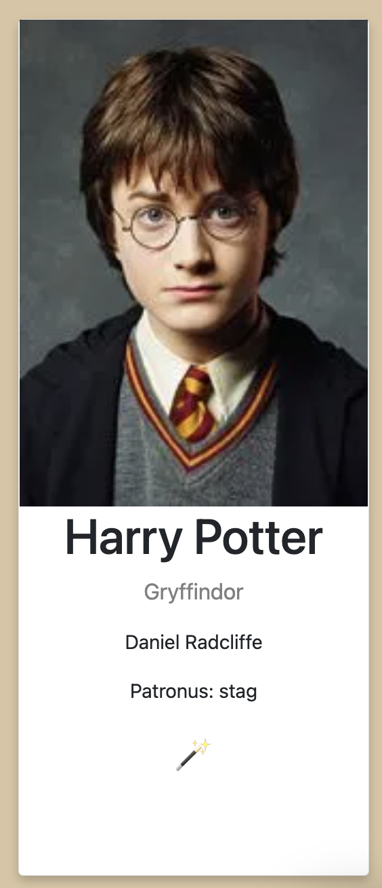

# Harry Potter Wiki

**TASK**: You have been tasked with building a wiki for Harry Potter fans using the [Harry Potter API](https://hp-api.onrender.com/api/characters). The API returns lots of information about each character (name, house, actor that played this character, etc.) that we want to output in an individual card for each character. Rather than using a button to fetch the data, we want to data to be fetched once on page load so that cards appear as soon as users navigate to the page.

## What To Do

> It helps to explore the endpoint to see how the data is structured and have it open in a separate tab as you build as it returns a list of objects with keys you will need to access.

### `App.js`
1. Import `useEffect`, `useState`, and the `CharacterCard` at the top of the file.
2. Declare a `characters` state variable and create `setCharacters` updated function. Initialize the `characters` state as an empty array.
3. Create an asynchronous `handleRequest` that:
    - Fetches data from the Harry Potter API: https://hp-api.onrender.com/api/characters
    - Converts the response to a JSON object.
    - Updates the `characters` state with the response from the API.
4. Create a `useEffect` function that calls the `handleRequest` function. Don't forget to include the dependency array!
5. Inside `
`, use `.map()` to render a `CharacterCard` for each character object. Pass the object for each character as a prop.

### `CharacterCard.js`

1. Destructure the prop in the `CharacterCard` function definition.
2. In the `<h1>` element, output the name of each character.
3. In the `
`, output the Hogwarts house that each character is a part of.
4. In the `
` output the actor that played this character.
5. Some characters have an image, while others simply have a `""`. If there is an image, output the image above the `<h1>` element with an `alt` property of the characters name. If no image link exists for that character, output nothing.
6. If the character has a patronus, output the patronus in a `
` element as `Patronus: CHARACTERS_PATRONUS`. If no patronus exists, output nothing.
7. Finally, if the `ancestory` is listed as `muggle`, output a 👩 in a `
` element. Otherwise, output a 🪄 in a `
` element.