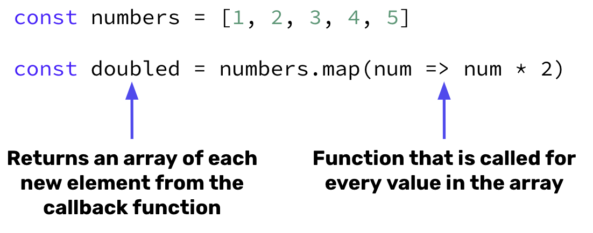

>If you need additional practice with `.map()` before starting with React, check out the section on [`.map()`,`.filter()`, and `.reduce()`](../../../02/3-prodigies/2-map-filter-reduce/README.md).

# `.map` and React Props
- Often, we want to create many instances of the same component that contain different props.
- JSX allows for us to use Javascript to apply logic to the JSX components by simply using curly braces `{}`.
- We can store information in an array and use the `.map()` method to dynamically render our components with props coming in from a list of objects. 

## `.map()` Syntax 🖊️



## `map()` and React Components 🖊️


## `map()` and Components Example

We have a set of names that we want to render a name card for. Initially, we return 3 name cards each with their own prop.

```jsx
function App() {
    return(
        <NameCard name = "Luisa"/>
        <NameCard name = "Hillary"/>
        <NameCard name = "Donovan"/>
    )
}

function NameCard({ name }) {
    return(
        <h1>Hello my name is { name }</h1>
    )
}
```

However, this is inefficient as we add more cards. We create an array called `names` that holds each persons name and then use the `.map()` function to return a `NameCard` for each name. **Remember, any JavaScript expression needs to be enclosed inside a `{ }`**.

```jsx
function App() {
    let names = ["Luisa", "Hillary", "Donovan"]
    return(
        {/*Iterates through each name and returns a NameCard component that contains the name as a prop*/}
        {names.map(item => <NameCard name = {item}/>)}
    )
}

function NameCard({ name }) {
    return(
        <h1>Hello my name is { name }</h1>
    )
}
```

## #checkoutTheDocs 🔍
- **MDN**: [Array.prototype.map()](https://developer.mozilla.org/en-US/docs/Web/JavaScript/Reference/Global_Objects/Array/map)
- **React**: [Introducing JSX](https://reactjs.org/docs/introducing-jsx.html#embedding-expressions-in-jsx)

## Video Resources 🎥
- [Maps and Loops in JSX](https://www.youtube.com/watch?v=5llXA0RTYIU)